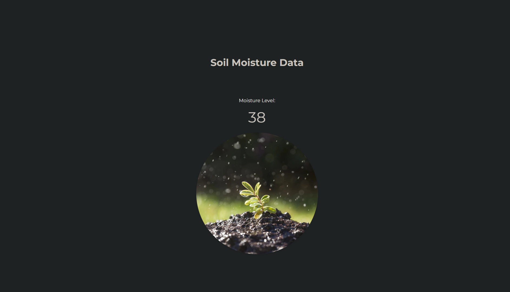

# auto_irrigation_system
Codebase to automatically water your plants using a DC Pump through Arduino UNO and NodeMCU.

## Instructions

* Flash your Arduino UNO with the following [code](arduino.ino).

* Flash your NodeMCU with the following [code](nodemcu.ino). Make sure to match the SSID and password of your WiFi network, and the IP address of your server.

* Make the following connections:

  

* Launch the http server using the following command:

  ```bash
  python3 server.py
  ```

* Finally, open the web page on your browser:
    
  ```bash
  http://<IP_ADDRESS_OF_SERVER>:8000
  ```

  